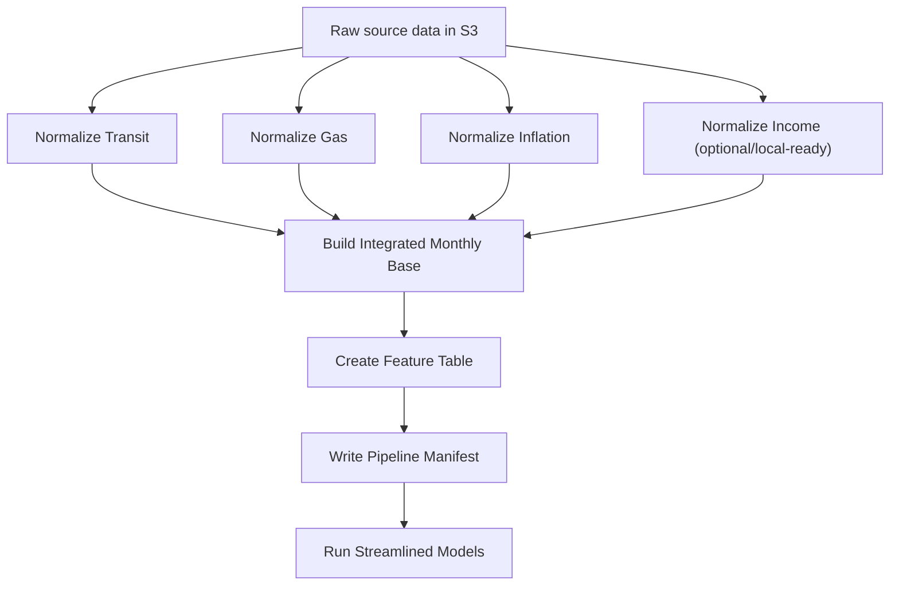

# Transit ML Pipeline

Production-shaped transit demand forecasting pipeline for a portfolio project focused on data engineering, historical forecasting, and MLOps-style experiment design.

The project uses King County transit ridership and service data, Seattle gas prices, inflation, and King County median household income to build a monthly feature table for historical forecasting experiments. The current AWS pipeline is containerized, orchestrated, and writes traceable run artifacts to S3. A local experiment runner, DuckDB mart, and Streamlit dashboard turn those artifacts into a portfolio-facing forecasting lab.

## Project Goal

The long-term goal is to build a historical forecasting lab that asks:

> What would this forecasting system have looked like if it had been deployed monthly starting around 2011?

The planned modeling layer will simulate monthly as-of-date forecasts, compare model classes and feature families, and surface results in a dashboard aimed at recruiters and technical reviewers.

Primary target:

- `upt` - unlinked passenger trips

Potential secondary target:

- `vrm` - vehicle revenue miles

Forecast horizon:

- 3 months ahead

## Current Pipeline



The validated AWS Step Functions workflow currently runs the core normalizers,
integration, feature creation, manifest, and streamlined model states:

```text
Initialize Run Context
→ Parallel normalizers
   → Normalize Transit
   → Normalize Gas
   → Normalize Inflation
→ Build Integrated Monthly Base
→ Create Feature Table
→ Write Pipeline Manifest
→ Run Streamlined Models
```

The normalizers run in parallel, and downstream steps wait until all required
normalized inputs exist. Income is implemented in the local project and ready to
wire into AWS when the next container/task-definition update is promoted.

## What Is Working

- Docker image builds locally and runs in ECS Fargate.
- One shared container image runs multiple pipeline scripts via ECS command overrides.
- Step Functions orchestrates ECS tasks and waits for completion.
- ECS task roles read/write S3 and retrieve required secrets.
- Pipeline runs are partitioned by `run_id`, avoiding same-day overwrites.
- Runtime metadata captures `PIPELINE_RUN_ID` and `IMAGE_URI`.
- A top-level run manifest is written to S3 after each successful pipeline run.
- A streamlined modeling comparison runs in ECS and writes dashboard-ready artifacts.
- King County income is now supported as an optional FRED source and included in downstream feature families when present.
- The Streamlit dashboard has a sidebar structure for project narrative pages and a results explorer for model comparison.
- A first medium local experiment has produced dashboard-shaped artifacts for design validation.
- `build_experiment_mart.py` loads experiment artifacts into DuckDB and exports dashboard-compatible Parquet/JSON views.
- CloudWatch log retention is set for the ECS log group.

## Main Scripts

| Script | Purpose |
|---|---|
| `normalize_transit.py` | Normalizes monthly transit ridership/service data |
| `normalize_eia_gas.py` | Normalizes Seattle gas price data |
| `normalize_fred_inflation.py` | Normalizes inflation data from FRED raw output |
| `normalize_fred_income.py` | Normalizes King County income data from FRED raw output |
| `build_integrated_monthly_base.py` | Joins normalized sources into one monthly base table |
| `create_feature_table.py` | Builds modeling features, feature families, and imputation audit outputs |
| `write_pipeline_manifest.py` | Writes a top-level S3 manifest for the completed pipeline run |
| `run_aws_streamlined_models.py` | Runs the AWS-friendly model comparison and dashboard artifact export |
| `run_autoregressive_models.py` | Runs Phase B ARIMA/SARIMA/SARIMAX experiments with the same artifact contract |
| `combine_experiment_results.py` | Combines compatible experiment result folders for mixed dashboard comparison |
| `plan_large_experiment.py` | Expands experiment configs into pre-run count and scale summaries |
| `build_experiment_mart.py` | Loads result artifacts into DuckDB and exports dashboard-compatible views |
| `build_public_dashboard_bundle.py` | Creates a smaller static dashboard bundle for public Streamlit deployment |
| `lambda_gas.py` | Local copy of gas ingestion Lambda |
| `lambda_inflation.py` | Local copy of inflation ingestion Lambda |
| `lambda_income.py` | Local copy of King County income ingestion Lambda |

## S3 Output Layout

Pipeline outputs are partitioned by run ID:

```text
normalized/transit/run_id=<run_id>/transit_normalized.parquet
normalized/gas/run_id=<run_id>/gas_monthly_normalized.parquet
normalized/inflation/run_id=<run_id>/inflation_normalized.parquet
normalized/income/run_id=<run_id>/income_normalized.parquet
integrated/monthly_base/run_id=<run_id>/integrated_monthly_base.parquet
features/integrated_monthly_h3/run_id=<run_id>/feature_table.parquet
pipeline_runs/run_id=<run_id>/manifest.json
model_results/aws_streamlined/run_id=<run_id>/metrics.parquet
dashboard/aws_streamlined/run_id=<run_id>/performance_over_time.parquet
```

Each step also writes metadata JSON with row counts, date ranges, source/output keys, and runtime details.

## Streamlined Modeling

The AWS workflow includes a lightweight modeling comparison intended to produce dashboard-ready results without running the full local research sweep.

Current modeling scope:

- target: `upt`
- horizon: 3 months
- evaluation window: configurable; current medium dashboard-shaping run uses 2016-present
- modes: direct/raw and residual
- models: seasonal naive, Ridge, Lasso, XGBoost
- feature sets: generated feature families from `feature_families.json`

The evaluation window and cadence can be changed for wider historical simulations:

```bash
python run_aws_streamlined_models.py \
  --as-of-start 2016-01-01 \
  --as-of-end 2025-12-01 \
  --as-of-frequency-months 1 \
  --refit-frequency-months 1
```

For each `as_of_date`, the script trains only on rows before that date and forecasts the configured horizon ahead. The default horizon is 3 months.

For faster design-loop experiments, the runner can scope the model and feature
grid:

```bash
python run_aws_streamlined_models.py \
  --feature-table-uri feature_store/interaction_h3_smoke/feature_table.parquet \
  --feature-families-uri feature_store/interaction_h3_smoke/feature_families.json \
  --include-feature-family history_regime_time \
  --include-feature-family history_regime_time_linear_interactions \
  --include-model-type ridge \
  --include-model-type xgboost
```

The runner also supports model-aware feature policies and simple local
parallelism:

```bash
python run_aws_streamlined_models.py \
  --feature-policy none \
  --feature-policy corr_pruned \
  --n-jobs 4
```

Feature policies are fit inside each as-of training window, so selection steps
do not look at future rows. Current policy support includes correlation
pruning, variance pruning, mutual-information selection, Lasso-based selection,
and tree-importance selection. Policies that do not make sense for a model
family fall back to `none`.
XGBoost uses one internal thread per configuration when `--n-jobs` is greater
than one, which keeps the outer process-level parallelism from oversubscribing
the machine.

The residual mode follows the notebook pattern:

```text
residual target = actual H3 target - seasonal naive forecast
final prediction = seasonal naive forecast + residual model prediction
```

The model comparison writes:

```text
model_results/aws_streamlined/run_id=<run_id>/predictions.parquet
model_results/aws_streamlined/run_id=<run_id>/model_runs.parquet
model_results/aws_streamlined/run_id=<run_id>/metrics.parquet
model_results/aws_streamlined/run_id=<run_id>/feature_importance.parquet
model_results/aws_streamlined/run_id=<run_id>/feature_sets.parquet
model_results/aws_streamlined/run_id=<run_id>/feature_family_summary.parquet
model_results/aws_streamlined/run_id=<run_id>/complexity_profile.parquet
model_results/aws_streamlined/run_id=<run_id>/champion_selection.json
model_results/aws_streamlined/run_id=<run_id>/batch_manifest.json
model_results/aws_streamlined/run_id=<run_id>/experiment_manifest.json
```

Dashboard-shaped exports are written to:

```text
dashboard/aws_streamlined/run_id=<run_id>/forecast_paths.parquet
dashboard/aws_streamlined/run_id=<run_id>/performance_over_time.parquet
dashboard/aws_streamlined/run_id=<run_id>/model_leaderboard.parquet
dashboard/aws_streamlined/run_id=<run_id>/feature_family_summary.parquet
dashboard/aws_streamlined/run_id=<run_id>/champion_predictions.parquet
dashboard/aws_streamlined/run_id=<run_id>/champion_selection.json
dashboard/aws_streamlined/run_id=<run_id>/overview_top_models.parquet
dashboard/aws_streamlined/run_id=<run_id>/overview_prediction_paths.parquet
dashboard/aws_streamlined/run_id=<run_id>/complexity_profile.parquet
```

## Public Dashboard Bundle

The full local experiment export is intentionally larger than the public
portfolio dashboard needs. For Streamlit Community Cloud or another lightweight
host, the dashboard defaults to a curated static bundle at:

```text
dashboard/public_artifacts/latest/
```

Generate that bundle from the full dashboard export with:

```bash
python build_public_dashboard_bundle.py
```

The default public curation keeps configurations that rank in the best 5 percent
for at least one core performance metric, plus the baseline and champion
configurations. It keeps all forecast and performance rows for those retained
configurations, so the dashboard remains interactive while avoiding the full
local artifact size.

The full local bundle can still be used by setting:

```bash
export DASHBOARD_ARTIFACT_DIR=dashboard_artifacts/aws_streamlined/latest
export FEATURE_FAMILIES_PATH=feature_store/income_interactions_h3_v1/feature_families.json
streamlit run dashboard/app.py
```

For a dashboard-only deployment, install the slim dashboard dependencies:

```bash
pip install -r requirements-dashboard.txt
```

The full project requirements remain in `requirements.txt` for data processing,
modeling, MLflow, DuckDB, and AWS-oriented workflows.

Champion selection uses a weighted score:

```text
0.75 * MAE + 0.25 * RMSE
```

If configurations are within 2 percent of the best score, the selection rule prefers the simpler model.

`metrics.parquet` stores one row per model configuration and evaluation scope:

```text
overall
pre_covid
covid_shock
recovery
recent
```

The dashboard leaderboard pivots those long metric rows into period-specific columns and derived ratios such as `shock_penalty`, `recovery_ratio`, and `recent_recovery_ratio`.

The metrics also include ordinary R2 and nullable adjusted R2. Adjusted R2 is
currently populated as a linear-model diagnostic when there are enough
observations relative to selected predictors. It is useful for parsimony and
explainability discussion, but champion selection remains based on MAE/RMSE.

The feature table also includes a controlled interaction-feature experiment.
Rather than creating every pairwise interaction, it adds targeted regime
interactions around lagged ridership, time/seasonality, exogenous gas/CPI
signals, and service levels. These are exposed as separate
`*_linear_interactions` feature families so regularized linear models can be
compared against their non-interaction counterparts.

The income expansion uses FRED's King County median household income series
(`MHIWA53033A052NCEN`). Because it is annual, the normalized monthly table uses
prior-year income as the socioeconomic context for each month and records
whether the reference value is observed or projected. Feature families include
income level/growth indicators plus affordability-pressure interactions with
gas and CPI.

The experiment artifacts now carry forward-compatible complexity and
representation metadata. Tabular runs currently use `representation_policy =
tabular_raw`; later neural-net/RNN experiments can use sequence and PCA-style
representation policies without changing the dashboard contract.

The experiment metadata contract is documented in:

```text
docs/experiment_metadata_contract.md
```

## Large Local Experiments

The local research track is now split into experiment blocks that write the same
portable artifacts.

Phase A covers feature-table-driven baseline, linear, bagging, randomized
bagging, and boosting models:

```bash
.venv/bin/python run_aws_streamlined_models.py \
  --experiment-config experiment_configs/large_phase_a_v1.yaml
```

Phase B covers autoregressive models:

```bash
.venv/bin/python run_autoregressive_models.py \
  --experiment-config experiment_configs/phase_b_autoregressive_v1.yaml
```

Phase C covers PyTorch neural and recurrent sequence models. Install the
additional neural dependencies separately so the core ECS pipeline image does
not carry an unnecessary PyTorch layer:

```bash
python -m pip install -r requirements-neural.txt
```

Run the local CPU contract smoke test before moving a larger grid to a
GPU-capable Linux machine or Colab:

```bash
.venv/bin/python run_neural_models.py \
  --experiment-config experiment_configs/phase_c_neural_smoke.yaml
```

Run the policy and PCA contract smoke test as well:

```bash
.venv/bin/python run_neural_models.py \
  --experiment-config experiment_configs/phase_c_neural_policy_smoke.yaml
```

The Phase C runner currently supports MLP, RNN, GRU, and LSTM builds using
ordered sequence windows, time-ordered validation rows, early stopping, and
`ReduceLROnPlateau` learning-rate scheduling. Feature and target scalers are
fit only on the training portion of each historical as-of window. Completed
model configurations are written to resumable chunk artifacts so an
interrupted GPU session can continue without repeating finished work. The
runner writes the same portable Parquet/JSON contract as Phases A and B so
neural results can be merged into the DuckDB-backed dashboard export.
Neural configs can branch across training-window-safe feature policies and
sequence representations. Implemented feature policies are `none`,
`variance_pruned`, `corr_pruned`, and `mutual_info_top_30`. Implemented
representations are `sequence_raw`, `sequence_pca_20`, and `sequence_pca_95`.

Review the compact GPU-screening grid before launching it:

```bash
.venv/bin/python plan_neural_experiment.py \
  --config experiment_configs/phase_c_neural_screening.yaml
```

The draft screening stage evaluates `96` neural configurations over `40`
quarterly rolling as-of dates: `3,840` fits. Its purpose is to identify
promising architectures and parameter neighborhoods before rerunning finalists
with monthly refits. See `docs/phase_c_neural_experiment_plan.md` for the Colab
transfer workflow and the decisions intentionally deferred until after the
screen.

After reviewing the architecture screen, inspect the higher-ceiling refinement
stage:

```bash
.venv/bin/python plan_neural_experiment.py \
  --config experiment_configs/phase_c_neural_refinement.yaml
```

The refinement stage evaluates `360` curated configurations over `40`
quarterly rolling as-of dates: `14,400` fits. It raises the epoch ceiling to
`120`, keeps early stopping and learning-rate scheduling, and compares six
purposeful feature-policy/representation variants without expanding every
selector across every PCA branch.

If the compact neural models remain underfit, run the capacity-screen contract
smoke:

```bash
.venv/bin/python run_neural_models.py \
  --experiment-config experiment_configs/phase_c_neural_capacity_smoke.yaml
```

Then inspect the larger recurrent-capacity screen:

```bash
.venv/bin/python plan_neural_experiment.py \
  --config experiment_configs/phase_c_neural_capacity_screen.yaml
```

The capacity screen evaluates `40` curated configurations over `40` quarterly
rolling as-of dates: `1,600` fits. It supports asymmetric recurrent stacks,
configurable dense prediction heads, Adam weight decay, and materially wider
LSTM candidates including a `1000 -> 100 -> 200 -> 10 -> 1` neighborhood.

After selecting recurrent-capacity finalists, inspect the full-history
feature-family screen:

```bash
.venv/bin/python plan_neural_experiment.py \
  --config experiment_configs/phase_c_neural_feature_family_screen.yaml
```

The widened screen evaluates the promoted GRU and LSTM structures across all
`21` current feature families from 2011 through the present simulation. It
enables dynamic policy deduplication: when two policies produce the same
rolling selected-feature history for a family and mode, the redundant branch
is skipped and documented in the experiment manifest.

Large neural screens can be split across independent workers:

```bash
python run_neural_models.py \
  --experiment-config experiment_configs/phase_c_neural_feature_family_screen.yaml \
  --shard-index 0 \
  --shard-count 4
```

Each shard writes isolated result, chunk, and checkpoint folders so the
completed artifact bundles can be merged after all workers finish.

The Phase B grid includes ARIMA, SARIMA, and SARIMAX configurations. SARIMAX
uses compact service, economic, income-pressure, and service-plus-economic
exogenous sets. Those outputs can be merged back with Phase A for a unified
leaderboard and forecast explorer:

```bash
.venv/bin/python combine_experiment_results.py \
  --results-dir experiments_output/large_phase_a_v1/results \
  --results-dir experiments_output/phase_b_autoregressive_v1/results \
  --output-results-dir experiments_output/combined_phase_ab_v1/results \
  --output-dashboard-dir dashboard_artifacts/aws_streamlined/combined_phase_ab_v1 \
  --experiment-id combined_phase_ab_v1
```

Then rebuild the DuckDB-backed dashboard export:

```bash
.venv/bin/python build_experiment_mart.py \
  --results-dir experiments_output/combined_phase_ab_v1/results \
  --dashboard-dir dashboard_artifacts/aws_streamlined/combined_phase_ab_v1 \
  --duckdb-path experiments_output/combined_phase_ab_v1/experiments.duckdb \
  --dashboard-export-dir dashboard_artifacts/aws_streamlined/combined_phase_ab_v1_from_duckdb \
  --replace
```

The medium local dashboard-shaping runs are documented in:

```text
docs/medium_experiment_v1.md
docs/medium_experiment_v2.md
```

`medium_v2` supersedes `medium_v1` for dashboard iteration because it includes
the seasonal-naive baseline cleanup. The baseline now appears once as
`baseline_naive` instead of once per feature family.

The streamlined runner now carries forward durable experiment identifiers such as `experiment_id`, `model_config_id`, `model_run_id`, and `feature_set_id`. It also supports optional MLflow experiment logging:

```bash
python run_aws_streamlined_models.py \
  --enable-mlflow \
  --mlflow-tracking-uri mlruns \
  --mlflow-experiment-name transit-forecasting
```

MLflow is used as an experiment tracker/lab notebook. The dashboard should continue reading curated Parquet/JSON artifacts rather than depending on a live MLflow server.

## Large Experiment Planning

The next larger local sweep is being drafted as Phase A:

```text
experiment_configs/large_phase_a_v1.yaml
docs/large_experiment_phase_a_plan.md
```

Phase A focuses on tabular models that use the current monthly feature table:

- seasonal naive
- Ridge
- Lasso
- ElasticNet
- Random Forest
- Extra Trees
- XGBoost

Use the planner before launching the run:

```bash
python plan_large_experiment.py \
  --config experiment_configs/large_phase_a_v1.yaml
```

The planner expands the config into estimated model configuration counts and
model/as-of rows without training anything. ARIMA/SARIMAX and neural-net models
are intentionally reserved for later phases because they need different
time-series/windowed training mechanics.

Current Phase A planner size:

- 180 monthly as-of origins
- 2,227 model configurations
- 400,860 estimated model/as-of rows
- 21 of 21 requested feature families validated

The full Phase A run completed locally and exported dashboard-ready artifacts
through the DuckDB mart:

```text
experiments_output/large_phase_a_v1/experiments.duckdb
dashboard_artifacts/aws_streamlined/large_phase_a_v1_from_duckdb
```

The selected Phase A champion was XGBoost in raw mode with the
`history_regime_time` feature family.

The runner now supports Phase A config-driven smoke tests:

```bash
python run_aws_streamlined_models.py \
  --experiment-config experiment_configs/phase_a_smoke.yaml
```

That smoke config exercises all Phase A model builds plus chunk/resume behavior
over a tiny window before the full local sweep is launched.

The next Phase A rerun candidate is:

```text
experiment_configs/large_phase_a_v2_complexity.yaml
```

It expands model-aware feature-policy coverage and writes
`complexity_profile.parquet`. A small smoke version has been validated, but the
large v2 rerun has not been launched.

## Experiment Mart

Completed model-result artifacts can be loaded into a local DuckDB experiment
mart for SQL analysis and dashboard export validation.

```bash
python build_experiment_mart.py \
  --results-dir experiments_output/medium_v1/results \
  --dashboard-dir dashboard_artifacts/aws_streamlined/medium_v1 \
  --duckdb-path experiments_output/medium_v1/experiments.duckdb \
  --dashboard-export-dir dashboard_artifacts/aws_streamlined/medium_v1_from_duckdb \
  --replace
```

The mart contains raw experiment tables such as `predictions`, `model_runs`,
`metrics`, `feature_sets`, `feature_importance`, and `complexity_profile`, plus
dashboard-shaped views such as `forecast_paths`, `model_leaderboard`,
`performance_over_time`, and `complexity_profile_dashboard`.

When an existing dashboard artifact folder is supplied, the builder preserves
that presentation shape and exports compatible dashboard files. This keeps
Streamlit working while adding a SQL layer for larger local experiment analysis.

The public dashboard currently reads curated Parquet/JSON exports, not a live
DuckDB connection. DuckDB is the local analytical mart used to validate, query,
and reshape larger experiment outputs before publishing a static artifact bundle.

## Run Context

Step Functions passes these values into each ECS task:

```text
PIPELINE_RUN_ID
IMAGE_URI
```

`PIPELINE_RUN_ID` ties all artifacts from one workflow execution together.

`IMAGE_URI` records the exact ECR image tag used for lineage and reproducibility.

## Local Setup

Create and activate a virtual environment:

```bash
python -m venv .venv
source .venv/bin/activate
```

Install dependencies:

```bash
pip install -r requirements.txt
```

Create a local `.env` file with project-specific values. Do not commit `.env`.

## Docker Build

Build the runtime image:

```bash
docker build --platform linux/amd64 -t transit-ml-pipeline:local .
```

The Docker image defaults to:

```bash
python create_feature_table.py
```

In ECS, individual jobs are selected with command overrides, such as:

```json
["python", "normalize_transit.py"]
```

## AWS Architecture

Current AWS services used:

- S3 for raw, normalized, integrated, feature, and manifest artifacts
- ECR for the container image
- ECS Fargate for pipeline jobs
- Step Functions for orchestration
- CloudWatch Logs for task logs
- Secrets Manager for sensitive API keys
- Lambda for upstream ingestion jobs

The project currently uses public Fargate tasks for simplicity during portfolio development. A more production-oriented version could move tasks to private subnets with NAT or VPC endpoints.

## Historical Modeling Plan

The current modeling layer already supports historical backtesting. The next
major step is scaling the run definition from dashboard-shaping experiments to a
larger local research sweep.

Planned concept:

```text
for each monthly as_of_date from 2011 onward:
    train only on data available as of that date
    forecast target value 3 months ahead
    compare against the eventual actual value
```

The experiment layer should compare:

- model classes, such as naive, regularized linear models, tree models, and XGBoost
- feature families, such as parsimonious, lag-only, exogenous, and full feature sets
- performance vs interpretability tradeoffs
- runtime and artifact-size footprint

The AWS workflow can run a streamlined comparison to prove orchestration. Larger
experiment sweeps may be run locally to control AWS cost, loaded into DuckDB for
analysis, and then exported as curated artifacts for the dashboard.

## Dashboard Direction

The dashboard is intended as a read-only portfolio demo, not an experiment launcher.

Current top-level sections:

- Project Overview
- System
- Data
- Experiment
- Results Explorer

The Results Explorer contains:

- Modeling Overview
- Forecast Explorer
- Model Performance
- Feature Strategy
- Operational Footprint

The dashboard should read from curated static artifacts rather than triggering training jobs.

Near-term dashboard work is focused on inspecting the `medium_v2` artifact and
making the current medium experiment easy to interpret before the broader
experiment sweep.

## Current Next Steps

- Inspect the dashboard for model ranking, period metrics, and feature-policy behavior.
- Make any small dashboard corrections exposed by the `medium_v2` artifact.
- Decide the broader local experiment grid.
- Then expand into the larger local experiment sweep and publish the resulting curated dashboard artifacts.

## Notes

- Local data, generated feature stores, reference files, and local planning notes are intentionally ignored.
- Secrets are not committed.
- `CHANGE_DOC.md` contains a more detailed development change history.
