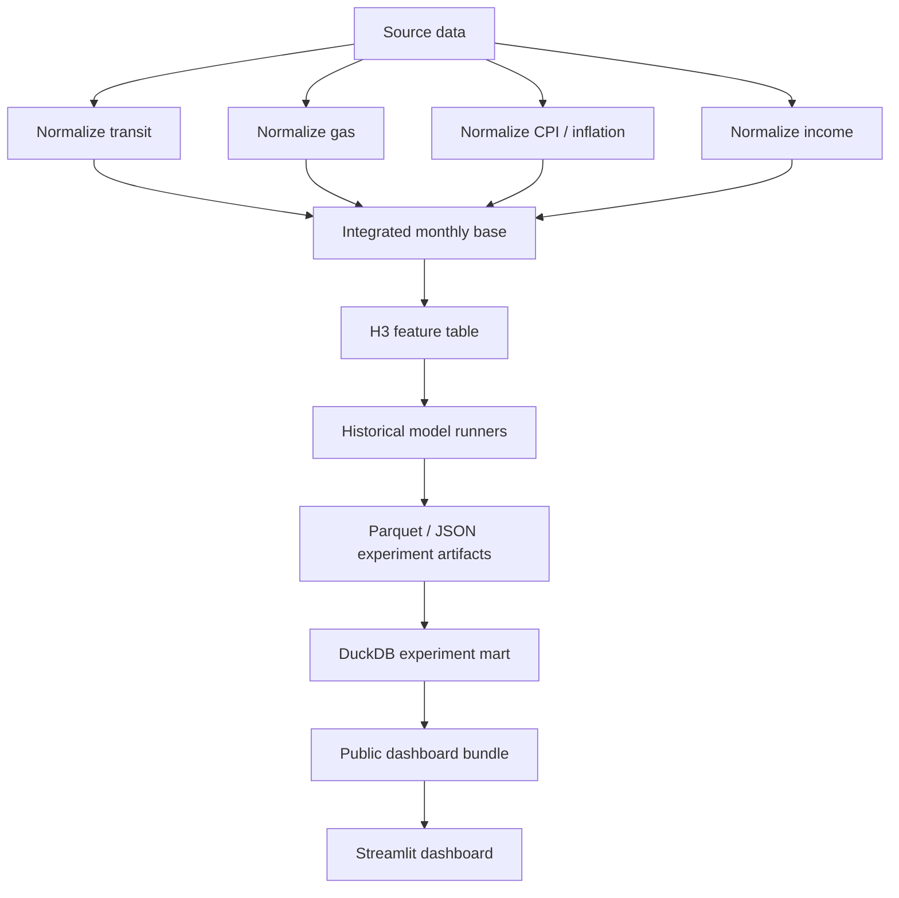

# Transit Forecasting Lab

A production-shaped transit demand forecasting project that combines data engineering, historical forecast simulation, experiment tracking, and a public Streamlit dashboard.

The project asks a practical forecasting question:

> What would this forecasting system have looked like if it had been deployed monthly starting around 2011?

The current system uses monthly transit ridership and service data, Seattle gasoline prices, CPI/inflation, and King County median household income to forecast King County transit ridership three months ahead. The project is intentionally framed as a forecasting lab rather than a single model fit: each model is evaluated through repeated rolling as-of dates under a shared artifact contract.

## Live Dashboard

The public dashboard is a static Streamlit app backed by committed Parquet/JSON artifacts:

```text
dashboard/app.py
dashboard/public_artifacts/latest/
```

Current dashboard shape:

- Project Overview, Data, System, Experiment, Model Explorer, and Insights sections.
- Full model metadata index for the public experiment bundle.
- Curated flat path files for fast initial loading and compatibility.
- Partitioned full forecast/performance rows loaded on demand after model filters are applied.
- Model Explorer controls for model build, mode, feature family, feature policy, feature transform, rank metric, per-build limit, total limit, path mode, and date window.
- Insights page that distills selected experiment findings, including COVID shock behavior and XGBoost follow-up ablation ideas.

The current public bundle includes:

| Artifact Layer | Current Count / Role |
|---|---:|
| Full model index | 8,480 model configurations |
| Curated flat configs | 2,572 configurations |
| Full forecast rows | 1,526,400 rows, partitioned by model build |
| Flat forecast rows | 462,960 rows |

## Forecast Target

| Item | Value |
|---|---|
| Primary target | `upt` - unlinked passenger trips |
| Forecast horizon | 3 months ahead |
| Forecast cadence | monthly rolling as-of dates |
| Current target window | April 2011 through March 2026 |
| Evaluation periods | pre-COVID, COVID shock, recovery, recent |

## Data Sources

| Source | Role |
|---|---|
| FTA National Transit Database monthly ridership | Primary ridership and service context: UPT, VRM, VRH, VOMS |
| EIA gasoline prices | Transportation cost context |
| FRED CPI series | General and core price-pressure context |
| FRED King County median household income | Annual socioeconomic context converted into prior-year monthly context |

The source-data workflow normalizes each feed to a monthly grain, joins the sources into an integrated monthly base table, then builds a feature table with lagged history, rolling statistics, target-month seasonality, regime context, exogenous signals, service context, income/affordability pressure, and targeted interactions.

## System Architecture



The project has two complementary execution paths:

- **AWS-oriented pipeline:** containerized Python scripts, ECS Fargate tasks, Step Functions orchestration, S3 artifacts, and CloudWatch logs.
- **Local research pipeline:** broader model sweeps, DuckDB mart creation, public dashboard bundle generation, and notebook-backed interpretation.

Streamlit does not train models and does not query a live experiment server. It reads static dashboard artifacts generated after experiments complete.

## Repository Map

| Path | Purpose |
|---|---|
| `dashboard/app.py` | Streamlit app shell: theme, artifact loading, and page routing |
| `dashboard/sections/` | Page renderers for Overview, Data, System, Experiment, Model Explorer, and Insights |
| `dashboard/charts.py` | Reusable Plotly chart builders |
| `dashboard/data_access.py` | Cached dashboard artifact/source-table loading helpers |
| `dashboard/model_helpers.py` | Shared model-ranking, filtering, score-table, and path-loading helpers |
| `dashboard/formatting.py` | Shared labels, number formatting, and display-name helpers |
| `dashboard/ui_components.py` | Reusable HTML/Streamlit UI fragments |
| `dashboard/content.py` | Longer dashboard narrative/content blocks |
| `dashboard/requirements.txt` | Streamlit Cloud runtime dependencies |
| `dashboard/public_artifacts/latest/` | Committed public dashboard artifact bundle |
| `build_public_dashboard_bundle.py` | Builds the static public dashboard bundle from a full dashboard export |
| `build_experiment_mart.py` | Loads experiment artifacts into DuckDB and exports dashboard-compatible views |
| `combine_experiment_results.py` | Combines compatible experiment result folders |
| `run_aws_streamlined_models.py` | Phase A tabular/baseline/linear/tree/XGBoost historical experiment runner |
| `run_autoregressive_models.py` | Phase B ARIMA/SARIMA/SARIMAX runner |
| `run_neural_models.py` | Phase C PyTorch neural/recurrent runner |
| `run_tensorflow_neural_models.py` | TensorFlow/Keras neural experiment runner |
| `experiment_configs/` | YAML experiment grids and runtime settings |
| `docs/experiment_metadata_contract.md` | Shared artifact/schema contract |
| `notebooks/archive/` | Legacy notebooks retained for project history |
| `local_notes/` | Local review notes, ignored by git and Docker |

## Main Pipeline Scripts

| Script | Purpose |
|---|---|
| `normalize_transit.py` | Normalizes monthly transit ridership/service data |
| `normalize_eia_gas.py` | Normalizes Seattle gas price data |
| `normalize_fred_inflation.py` | Normalizes CPI/inflation data |
| `normalize_fred_income.py` | Normalizes King County median household income |
| `build_integrated_monthly_base.py` | Joins normalized sources into one monthly base table |
| `create_feature_table.py` | Builds H3 modeling features, feature families, and imputation audit outputs |
| `write_pipeline_manifest.py` | Writes a top-level manifest for completed pipeline runs |
| `plan_large_experiment.py` | Expands Phase A configs into pre-run scale summaries |
| `plan_neural_experiment.py` | Expands neural configs into pre-run scale summaries |

## Experiment Phases

| Phase | Scope |
|---|---|
| Phase A | Seasonal baseline, regularized linear models, Random Forest, Extra Trees, XGBoost |
| Phase B | ARIMA, SARIMA, SARIMAX autoregressive models |
| Phase C | Neural/recurrent sequence models, including GRU/LSTM experiments |
| Linear transform follow-up | Signed-log, quadratic, cubic, and combined transform screens for regularized linear models |

All experiment families write portable Parquet/JSON outputs under the same broad contract: predictions, model runs, metrics, feature sets, feature-family summaries, complexity profiles, champion selection, and experiment manifests.

## Feature Families And Policies

Feature families define the candidate signals available to a model. Examples include recent ridership history, rolling history, target-month seasonality, service context, regime context, CPI/gas/income context, and targeted interaction terms.

Feature policies are applied inside each rolling as-of training window, so feature selection does not look into the future. Current policies include:

- `none`
- correlation pruning
- variance pruning
- mutual-information top-k selection
- lasso-based selection
- tree-importance top-k selection

Feature transforms are tracked separately from feature families. Linear-model transform screens currently include:

- No transform
- Signed log
- Quadratic
- Cubic
- Signed log + quadratic + cubic

Those transform screens are broad regularized experiments, not variable-specific transform prescriptions.

## Metrics And Selection

Champion selection uses a weighted score:

```text
0.75 * MAE + 0.25 * RMSE
```

If configurations are within a small tolerance of the best score, the selection logic prefers simpler models.

The artifact contract also stores period-specific metrics for:

- `overall`
- `pre_covid`
- `covid_shock`
- `recovery`
- `recent`

The dashboard surfaces derived metrics such as shock penalty, recovery ratio, recent/recovery ratio, typical score, balanced score, and large-error score.

## Public Dashboard Bundle

The full local experiment archive is larger than a lightweight public app needs. The public bundle therefore keeps two layers:

1. **Full lightweight metadata:** model leaderboard, complexity profile, and feature-family summary for the full indexed experiment set.
2. **Path-level data:** curated flat files for compatibility plus partitioned full forecast/performance rows that can be loaded on demand after filters are applied.

The Streamlit app is intentionally lazy-loaded: overview and documentation pages read only manifests and small summary artifacts, while heavier forecast/performance rows are loaded only inside result-exploration views that need path-level data.

Generate the public bundle with:

```bash
.venv/bin/python build_public_dashboard_bundle.py
```

The default output is:

```text
dashboard/public_artifacts/latest/
```

The bundle manifest files are:

```text
experiment_manifest.json
public_bundle_manifest.json
path_partition_manifest.json
```

## Running The Dashboard Locally

Install dashboard dependencies:

```bash
.venv/bin/python -m pip install -r dashboard/requirements.txt
```

Run against the committed public bundle:

```bash
DASHBOARD_ARTIFACT_DIR=dashboard/public_artifacts/latest \
.venv/bin/python -m streamlit run dashboard/app.py --server.port 8507
```

The app can also point at another dashboard artifact folder:

```bash
DASHBOARD_ARTIFACT_DIR=/path/to/dashboard_export \
.venv/bin/python -m streamlit run dashboard/app.py
```

## Pre-Deploy Dashboard Smoke Check

Before pushing dashboard/public-bundle changes to the live site, run:

```bash
.venv/bin/python scripts/validate_dashboard_bundle.py
PYTHONPYCACHEPREFIX=/private/tmp/transit_pycache \
  .venv/bin/python -m py_compile \
  dashboard/app.py \
  dashboard/*.py \
  dashboard/sections/*.py \
  scripts/validate_dashboard_bundle.py
```

The validator checks required dashboard artifacts, core Parquet schemas,
manifest row counts, partition row counts, and whether
`dashboard/requirements.txt` covers imports used by the app shell and local
dashboard modules.

See `docs/dashboard_smoke_checklist.md` for the fuller pre-push and live-site
checklist.

## Requirements Files

| File | Purpose |
|---|---|
| `dashboard/requirements.txt` | Streamlit Cloud/runtime dependencies for `dashboard/app.py` |
| `requirements.txt` | Full local project dependencies for pipeline/modeling/MLflow/DuckDB workflows |
| `requirements-neural.txt` | Optional PyTorch neural experiment dependencies |
| `requirements-tensorflow.txt` | Optional TensorFlow/Keras experiment dependencies |

Streamlit Cloud currently detects and installs from `dashboard/requirements.txt` because the app entry point is `dashboard/app.py`.

## Current Analysis Notebooks

The current analysis notebooks remain at the repository root:

| Notebook | Purpose |
|---|---|
| `integrated_monthly_base_eda.ipynb` | EDA on the integrated monthly source table before feature engineering |
| `calculated_features_eda.ipynb` | EDA on the calculated H3 feature table |
| `experiment_results_insights.ipynb` | Directed experiment-result analysis that supports the dashboard Insights page |

Legacy notebooks have been moved to:

```text
notebooks/archive/
```

Historical planning docs have been moved to:

```text
docs/archive/
```

## MLflow Role

The project is MLflow-compatible, but the dashboard is not MLflow-backed.

Current behavior:

- Runners write Parquet/JSON artifacts as the durable experiment layer.
- Runners can optionally log compact experiment summaries to MLflow.
- The dashboard reads static Parquet/JSON artifacts exported from the DuckDB/dashboard bundle flow.

A fuller MLflow hierarchy with child runs by model family/configuration and promoted model stages would be a natural future MLOps extension, but it is not required for the current public dashboard.

## Local-Only Artifacts

Large local artifacts are intentionally excluded from git and Docker:

```text
raw_files/
feature_store/
experiments_output/
dashboard_artifacts/
mlruns/
local_notes/
*.zip
```

The committed public dashboard bundle is the exception:

```text
dashboard/public_artifacts/latest/
```

## Useful Commands

Plan a large Phase A experiment:

```bash
.venv/bin/python plan_large_experiment.py \
  --experiment-config experiment_configs/large_phase_a_v3_pandemic_safe.yaml
```

Run Phase A locally:

```bash
.venv/bin/python run_aws_streamlined_models.py \
  --experiment-config experiment_configs/large_phase_a_v3_pandemic_safe.yaml
```

Run Phase B autoregressive experiments:

```bash
.venv/bin/python run_autoregressive_models.py \
  --experiment-config experiment_configs/phase_b_autoregressive_v3_pandemic_safe.yaml
```

Build a DuckDB mart/export from completed experiment artifacts:

```bash
.venv/bin/python build_experiment_mart.py \
  --results-dir /path/to/results \
  --output-dir /path/to/dashboard_export
```

Build the public dashboard bundle:

```bash
.venv/bin/python build_public_dashboard_bundle.py
```

Validate the public dashboard bundle:

```bash
.venv/bin/python scripts/validate_dashboard_bundle.py
```

## Project Status

The project is currently strongest as a portfolio forecasting lab and systems artifact. Its most mature pieces are:

- Rolling as-of evaluation design.
- Leakage-aware feature construction and feature-policy fitting.
- Shared experiment artifact contract.
- DuckDB-to-dashboard export path.
- Public Streamlit dashboard with full metadata and on-demand partitioned path loading.
- EDA and Insights pages that explain source data, seasonality, transformed correlations, model behavior, and limitations.
- Modular dashboard structure with page modules, shared chart builders, cached data access, and model-result helpers.

Important next work:

- Add uncertainty intervals or conformal prediction diagnostics.
- Add residual diagnostics for top models by period and calendar month.
- Run a matched tree-family ablation to test why XGBoost dominates the current top-10 slice.
- Add experiment fairness/search coverage summaries across model families.
- Add lightweight browser-level dashboard smoke automation for the most important pages and controls.
