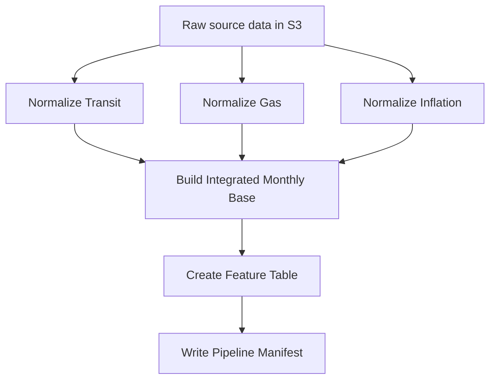

# Transit ML Pipeline

Production-shaped transit demand forecasting pipeline for a portfolio project focused on data engineering, historical forecasting, and MLOps-style experiment design.

The project uses King County transit ridership and service data, Seattle gas prices, and inflation series to build a monthly feature table for future forecasting experiments. The current AWS pipeline is containerized, orchestrated, and writes traceable run artifacts to S3.

## Project Goal

The long-term goal is to build a historical forecasting lab that asks:

> What would this forecasting system have looked like if it had been deployed monthly starting around 2011?

The planned modeling layer will simulate monthly as-of-date forecasts, compare model classes and feature families, and surface results in a dashboard aimed at recruiters and technical reviewers.

Primary target:

- `upt` - unlinked passenger trips

Potential secondary target:

- `vrm` - vehicle revenue miles

Forecast horizon:

- 3 months ahead

## Current Pipeline



The AWS Step Functions workflow currently runs:

```text
Initialize Run Context
→ Parallel normalizers
   → Normalize Transit
   → Normalize Gas
   → Normalize Inflation
→ Build Integrated Monthly Base
→ Create Feature Table
→ Write Pipeline Manifest
```

The normalizers run in parallel, and downstream steps wait until all required normalized inputs exist.

## What Is Working

- Docker image builds locally and runs in ECS Fargate.
- One shared container image runs multiple pipeline scripts via ECS command overrides.
- Step Functions orchestrates ECS tasks and waits for completion.
- ECS task roles read/write S3 and retrieve required secrets.
- Pipeline runs are partitioned by `run_id`, avoiding same-day overwrites.
- Runtime metadata captures `PIPELINE_RUN_ID` and `IMAGE_URI`.
- A top-level run manifest is written to S3 after each successful pipeline run.
- CloudWatch log retention is set for the ECS log group.

## Main Scripts

| Script | Purpose |
|---|---|
| `normalize_transit.py` | Normalizes monthly transit ridership/service data |
| `normalize_eia_gas.py` | Normalizes Seattle gas price data |
| `normalize_fred_inflation.py` | Normalizes inflation data from FRED raw output |
| `build_integrated_monthly_base.py` | Joins normalized sources into one monthly base table |
| `create_feature_table.py` | Builds modeling features, feature families, and imputation audit outputs |
| `write_pipeline_manifest.py` | Writes a top-level S3 manifest for the completed pipeline run |
| `lambda_gas.py` | Local copy of gas ingestion Lambda |
| `lambda_inflation.py` | Local copy of inflation ingestion Lambda |

## S3 Output Layout

Pipeline outputs are partitioned by run ID:

```text
normalized/transit/run_id=<run_id>/transit_normalized.parquet
normalized/gas/run_id=<run_id>/gas_monthly_normalized.parquet
normalized/inflation/run_id=<run_id>/inflation_normalized.parquet
integrated/monthly_base/run_id=<run_id>/integrated_monthly_base.parquet
features/integrated_monthly_h3/run_id=<run_id>/feature_table.parquet
pipeline_runs/run_id=<run_id>/manifest.json
```

Each step also writes metadata JSON with row counts, date ranges, source/output keys, and runtime details.

## Run Context

Step Functions passes these values into each ECS task:

```text
PIPELINE_RUN_ID
IMAGE_URI
```

`PIPELINE_RUN_ID` ties all artifacts from one workflow execution together.

`IMAGE_URI` records the exact ECR image tag used for lineage and reproducibility.

## Local Setup

Create and activate a virtual environment:

```bash
python -m venv .venv
source .venv/bin/activate
```

Install dependencies:

```bash
pip install -r requirements.txt
```

Create a local `.env` file with project-specific values. Do not commit `.env`.

## Docker Build

Build the runtime image:

```bash
docker build --platform linux/amd64 -t transit-ml-pipeline:local .
```

The Docker image defaults to:

```bash
python create_feature_table.py
```

In ECS, individual jobs are selected with command overrides, such as:

```json
["python", "normalize_transit.py"]
```

## AWS Architecture

Current AWS services used:

- S3 for raw, normalized, integrated, feature, and manifest artifacts
- ECR for the container image
- ECS Fargate for pipeline jobs
- Step Functions for orchestration
- CloudWatch Logs for task logs
- Secrets Manager for sensitive API keys
- Lambda for upstream ingestion jobs

The project currently uses public Fargate tasks for simplicity during portfolio development. A more production-oriented version could move tasks to private subnets with NAT or VPC endpoints.

## Historical Modeling Plan

The next major layer is historical backtesting.

Planned concept:

```text
for each monthly as_of_date from 2011 onward:
    train only on data available as of that date
    forecast target value 3 months ahead
    compare against the eventual actual value
```

The experiment layer should compare:

- model classes, such as naive, regularized linear models, tree models, and XGBoost
- feature families, such as parsimonious, lag-only, exogenous, and full feature sets
- performance vs interpretability tradeoffs
- runtime and artifact-size footprint

Large experiment sweeps may be run locally to control AWS cost, then uploaded as curated artifacts for the dashboard.

## Dashboard Direction

The dashboard is intended as a read-only portfolio demo, not an experiment launcher.

Likely sections:

- system overview and latest pipeline run
- historical forecast explorer
- model class comparison
- feature family comparison
- feature importance summaries
- operational footprint, such as pipeline duration, model training time, and artifact sizes

The dashboard should read from curated static artifacts rather than triggering training jobs.

## Notes

- Local data, generated feature stores, reference files, and local planning notes are intentionally ignored.
- Secrets are not committed.
- `CHANGE_DOC.md` contains a more detailed development change history.

