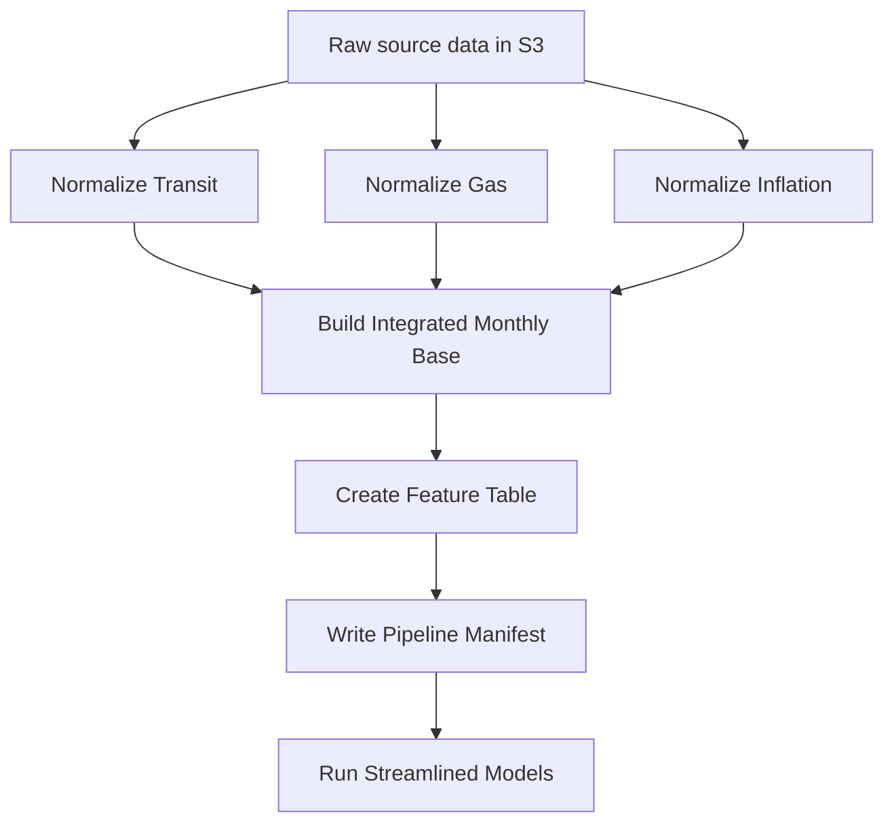

# Transit ML Pipeline

Production-shaped transit demand forecasting pipeline for a portfolio project focused on data engineering, historical forecasting, and MLOps-style experiment design.

The project uses King County transit ridership and service data, Seattle gas prices, and inflation series to build a monthly feature table for future forecasting experiments. The current AWS pipeline is containerized, orchestrated, and writes traceable run artifacts to S3.

## Project Goal

The long-term goal is to build a historical forecasting lab that asks:

> What would this forecasting system have looked like if it had been deployed monthly starting around 2011?

The planned modeling layer will simulate monthly as-of-date forecasts, compare model classes and feature families, and surface results in a dashboard aimed at recruiters and technical reviewers.

Primary target:

- `upt` - unlinked passenger trips

Potential secondary target:

- `vrm` - vehicle revenue miles

Forecast horizon:

- 3 months ahead

## Current Pipeline



The AWS Step Functions workflow currently runs:

```text
Initialize Run Context
→ Parallel normalizers
   → Normalize Transit
   → Normalize Gas
   → Normalize Inflation
→ Build Integrated Monthly Base
→ Create Feature Table
→ Write Pipeline Manifest
→ Run Streamlined Models
```

The normalizers run in parallel, and downstream steps wait until all required normalized inputs exist.

## What Is Working

- Docker image builds locally and runs in ECS Fargate.
- One shared container image runs multiple pipeline scripts via ECS command overrides.
- Step Functions orchestrates ECS tasks and waits for completion.
- ECS task roles read/write S3 and retrieve required secrets.
- Pipeline runs are partitioned by `run_id`, avoiding same-day overwrites.
- Runtime metadata captures `PIPELINE_RUN_ID` and `IMAGE_URI`.
- A top-level run manifest is written to S3 after each successful pipeline run.
- A streamlined modeling comparison runs in ECS and writes dashboard-ready artifacts.
- CloudWatch log retention is set for the ECS log group.

## Main Scripts

| Script | Purpose |
|---|---|
| `normalize_transit.py` | Normalizes monthly transit ridership/service data |
| `normalize_eia_gas.py` | Normalizes Seattle gas price data |
| `normalize_fred_inflation.py` | Normalizes inflation data from FRED raw output |
| `normalize_fred_income.py` | Normalizes King County income data from FRED raw output |
| `build_integrated_monthly_base.py` | Joins normalized sources into one monthly base table |
| `create_feature_table.py` | Builds modeling features, feature families, and imputation audit outputs |
| `write_pipeline_manifest.py` | Writes a top-level S3 manifest for the completed pipeline run |
| `run_aws_streamlined_models.py` | Runs the AWS-friendly model comparison and dashboard artifact export |
| `lambda_gas.py` | Local copy of gas ingestion Lambda |
| `lambda_inflation.py` | Local copy of inflation ingestion Lambda |
| `lambda_income.py` | Local copy of King County income ingestion Lambda |

## S3 Output Layout

Pipeline outputs are partitioned by run ID:

```text
normalized/transit/run_id=<run_id>/transit_normalized.parquet
normalized/gas/run_id=<run_id>/gas_monthly_normalized.parquet
normalized/inflation/run_id=<run_id>/inflation_normalized.parquet
normalized/income/run_id=<run_id>/income_normalized.parquet
integrated/monthly_base/run_id=<run_id>/integrated_monthly_base.parquet
features/integrated_monthly_h3/run_id=<run_id>/feature_table.parquet
pipeline_runs/run_id=<run_id>/manifest.json
model_results/aws_streamlined/run_id=<run_id>/metrics.parquet
dashboard/aws_streamlined/run_id=<run_id>/performance_over_time.parquet
```

Each step also writes metadata JSON with row counts, date ranges, source/output keys, and runtime details.

## Streamlined Modeling

The AWS workflow includes a lightweight modeling comparison intended to produce dashboard-ready results without running the full local research sweep.

Current modeling scope:

- target: `upt`
- horizon: 3 months
- evaluation window: 2021-present
- modes: direct/raw and residual
- models: seasonal naive, Ridge, Lasso, XGBoost
- feature sets: generated feature families from `feature_families.json`

The evaluation window and cadence can be changed for wider historical simulations:

```bash
python run_aws_streamlined_models.py \
  --as-of-start 2016-01-01 \
  --as-of-end 2025-12-01 \
  --as-of-frequency-months 1 \
  --refit-frequency-months 1
```

For each `as_of_date`, the script trains only on rows before that date and forecasts the configured horizon ahead. The default horizon is 3 months.

For faster design-loop experiments, the runner can scope the model and feature
grid:

```bash
python run_aws_streamlined_models.py \
  --feature-table-uri feature_store/interaction_h3_smoke/feature_table.parquet \
  --feature-families-uri feature_store/interaction_h3_smoke/feature_families.json \
  --include-feature-family history_regime_time \
  --include-feature-family history_regime_time_linear_interactions \
  --include-model-type ridge \
  --include-model-type xgboost
```

The runner also supports model-aware feature policies and simple local
parallelism:

```bash
python run_aws_streamlined_models.py \
  --feature-policy none \
  --feature-policy corr_pruned \
  --n-jobs 4
```

`corr_pruned` is currently applied only to linear models. It drops highly
correlated columns using each as-of training window, so the selection step does
not look at future rows. Tree and baseline models fall back to `none`.
XGBoost uses one internal thread per configuration when `--n-jobs` is greater
than one, which keeps the outer process-level parallelism from oversubscribing
the machine.

The residual mode follows the notebook pattern:

```text
residual target = actual H3 target - seasonal naive forecast
final prediction = seasonal naive forecast + residual model prediction
```

The model comparison writes:

```text
model_results/aws_streamlined/run_id=<run_id>/predictions.parquet
model_results/aws_streamlined/run_id=<run_id>/model_runs.parquet
model_results/aws_streamlined/run_id=<run_id>/metrics.parquet
model_results/aws_streamlined/run_id=<run_id>/feature_importance.parquet
model_results/aws_streamlined/run_id=<run_id>/feature_sets.parquet
model_results/aws_streamlined/run_id=<run_id>/feature_family_summary.parquet
model_results/aws_streamlined/run_id=<run_id>/champion_selection.json
model_results/aws_streamlined/run_id=<run_id>/batch_manifest.json
model_results/aws_streamlined/run_id=<run_id>/experiment_manifest.json
```

Dashboard-shaped exports are written to:

```text
dashboard/aws_streamlined/run_id=<run_id>/forecast_paths.parquet
dashboard/aws_streamlined/run_id=<run_id>/performance_over_time.parquet
dashboard/aws_streamlined/run_id=<run_id>/model_leaderboard.parquet
dashboard/aws_streamlined/run_id=<run_id>/feature_family_summary.parquet
dashboard/aws_streamlined/run_id=<run_id>/champion_predictions.parquet
dashboard/aws_streamlined/run_id=<run_id>/champion_selection.json
dashboard/aws_streamlined/run_id=<run_id>/overview_top_models.parquet
dashboard/aws_streamlined/run_id=<run_id>/overview_prediction_paths.parquet
```

Champion selection uses a weighted score:

```text
0.75 * MAE + 0.25 * RMSE
```

If configurations are within 2 percent of the best score, the selection rule prefers the simpler model.

`metrics.parquet` stores one row per model configuration and evaluation scope:

```text
overall
pre_covid
covid_shock
recovery
recent
```

The dashboard leaderboard pivots those long metric rows into period-specific columns and derived ratios such as `shock_penalty`, `recovery_ratio`, and `recent_recovery_ratio`.

The feature table also includes a controlled interaction-feature experiment.
Rather than creating every pairwise interaction, it adds targeted regime
interactions around lagged ridership, time/seasonality, exogenous gas/CPI
signals, and service levels. These are exposed as separate
`*_linear_interactions` feature families so regularized linear models can be
compared against their non-interaction counterparts.

The income expansion uses FRED's King County median household income series
(`MHIWA53033A052NCEN`). Because it is annual, the normalized monthly table uses
prior-year income as the socioeconomic context for each month and records
whether the reference value is observed or projected. Feature families include
income level/growth indicators plus affordability-pressure interactions with
gas and CPI.

The experiment metadata contract is documented in:

```text
docs/experiment_metadata_contract.md
```

The first medium local dashboard-shaping run is documented in:

```text
docs/medium_experiment_v1.md
```

The streamlined runner now carries forward durable experiment identifiers such as `experiment_id`, `model_config_id`, `model_run_id`, and `feature_set_id`. It also supports optional MLflow experiment logging:

```bash
python run_aws_streamlined_models.py \
  --enable-mlflow \
  --mlflow-tracking-uri mlruns \
  --mlflow-experiment-name transit-forecasting
```

MLflow is used as an experiment tracker/lab notebook. The dashboard should continue reading curated Parquet/JSON artifacts rather than depending on a live MLflow server.

## Experiment Mart

Completed model-result artifacts can be loaded into a local DuckDB experiment
mart for SQL analysis and dashboard export validation.

```bash
python build_experiment_mart.py \
  --results-dir experiments_output/medium_v1/results \
  --dashboard-dir dashboard_artifacts/aws_streamlined/medium_v1 \
  --duckdb-path experiments_output/medium_v1/experiments.duckdb \
  --dashboard-export-dir dashboard_artifacts/aws_streamlined/medium_v1_from_duckdb \
  --replace
```

The mart contains raw experiment tables such as `predictions`, `model_runs`,
`metrics`, `feature_sets`, and `feature_importance`, plus dashboard-shaped views
such as `forecast_paths`, `model_leaderboard`, and `performance_over_time`.

When an existing dashboard artifact folder is supplied, the builder preserves
that presentation shape and exports compatible dashboard files. This keeps
Streamlit working while adding a SQL layer for larger local experiment analysis.

## Run Context

Step Functions passes these values into each ECS task:

```text
PIPELINE_RUN_ID
IMAGE_URI
```

`PIPELINE_RUN_ID` ties all artifacts from one workflow execution together.

`IMAGE_URI` records the exact ECR image tag used for lineage and reproducibility.

## Local Setup

Create and activate a virtual environment:

```bash
python -m venv .venv
source .venv/bin/activate
```

Install dependencies:

```bash
pip install -r requirements.txt
```

Create a local `.env` file with project-specific values. Do not commit `.env`.

## Docker Build

Build the runtime image:

```bash
docker build --platform linux/amd64 -t transit-ml-pipeline:local .
```

The Docker image defaults to:

```bash
python create_feature_table.py
```

In ECS, individual jobs are selected with command overrides, such as:

```json
["python", "normalize_transit.py"]
```

## AWS Architecture

Current AWS services used:

- S3 for raw, normalized, integrated, feature, and manifest artifacts
- ECR for the container image
- ECS Fargate for pipeline jobs
- Step Functions for orchestration
- CloudWatch Logs for task logs
- Secrets Manager for sensitive API keys
- Lambda for upstream ingestion jobs

The project currently uses public Fargate tasks for simplicity during portfolio development. A more production-oriented version could move tasks to private subnets with NAT or VPC endpoints.

## Historical Modeling Plan

The next major layer is historical backtesting.

Planned concept:

```text
for each monthly as_of_date from 2011 onward:
    train only on data available as of that date
    forecast target value 3 months ahead
    compare against the eventual actual value
```

The experiment layer should compare:

- model classes, such as naive, regularized linear models, tree models, and XGBoost
- feature families, such as parsimonious, lag-only, exogenous, and full feature sets
- performance vs interpretability tradeoffs
- runtime and artifact-size footprint

The AWS workflow now runs a streamlined 2021-present comparison. Larger experiment sweeps may be run locally to control AWS cost, then uploaded as curated artifacts for the dashboard.

## Dashboard Direction

The dashboard is intended as a read-only portfolio demo, not an experiment launcher.

Likely sections:

- system overview and latest pipeline run
- historical forecast explorer
- model class comparison
- feature family comparison
- feature importance summaries
- operational footprint, such as pipeline duration, model training time, and artifact sizes

The dashboard should read from curated static artifacts rather than triggering training jobs.

## Notes

- Local data, generated feature stores, reference files, and local planning notes are intentionally ignored.
- Secrets are not committed.
- `CHANGE_DOC.md` contains a more detailed development change history.
