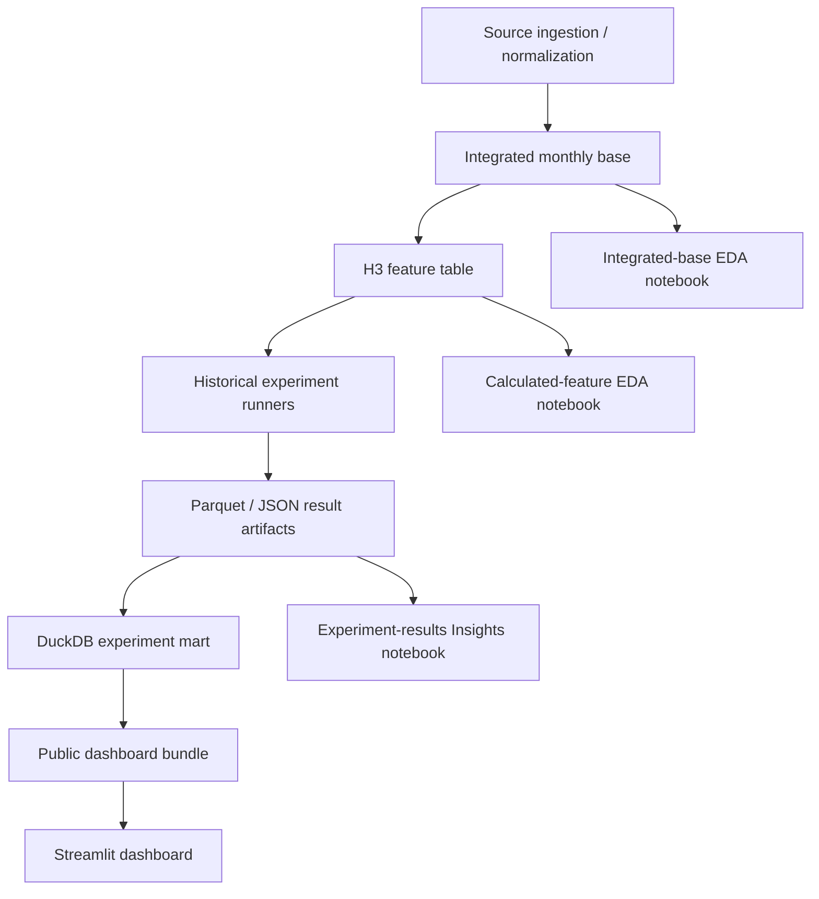

# Project Map And Canonical Workflow

This document is the quick orientation map for the Transit Forecasting Lab. The README explains the project story; this file explains where the moving pieces live and which workflow is canonical now.

## Canonical Flow



The dashboard is the public presentation layer. It does not train models and does not query a live experiment server. It reads static artifacts produced by the experiment/mart/bundle workflow.

## Source Ingestion Scripts

These scripts normalize source-specific inputs into monthly tables and metadata outputs.

| Script | Canonical Role | Notes |
|---|---|---|
| `normalize_transit.py` | Monthly transit ridership and service normalization | Produces UPT, VRM, VRH, VOMS context. |
| `normalize_eia_gas.py` | EIA gasoline price normalization | Produces monthly Seattle gas price context. |
| `normalize_fred_inflation.py` | FRED CPI/inflation normalization | Produces general and core CPI context. |
| `normalize_fred_income.py` | FRED King County median household income normalization | Annual source converted into prior-year monthly context downstream. |
| `lambda_gas.py` | Local copy of gas ingestion Lambda | Cloud ingestion support code, not the main local workflow. |
| `lambda_inflation.py` | Local copy of inflation ingestion Lambda | Cloud ingestion support code, not the main local workflow. |
| `lambda_income.py` | Local copy of income ingestion Lambda | Cloud ingestion support code, not the main local workflow. |

Canonical local source outputs are local-only and ignored by git:

```text
raw_files/
feature_store/
```

## Feature Table Pipeline

The feature pipeline moves from normalized monthly sources to model-ready H3 rows.

| Script | Canonical Role |
|---|---|
| `build_integrated_monthly_base.py` | Joins normalized transit, gas, CPI, and income sources into a common monthly base table. |
| `create_feature_table.py` | Builds the H3 feature table, feature-family definitions, imputation logs, and audit outputs. |
| `write_pipeline_manifest.py` | Writes a top-level pipeline manifest for completed pipeline runs. |

Important feature-table concepts:

- The forecast target is H3 UPT, meaning UPT three months ahead of each as-of month.
- Feature families define candidate signals such as history, service, regime, exogenous macro context, income pressure, and targeted interactions.
- Feature policies are applied inside each rolling as-of training window to avoid future leakage.
- Pandemic-safe regime features avoid future countdown-style information.

Canonical feature outputs are local-only unless included in a dashboard export:

```text
feature_store/income_interactions_h3_v1/
feature_store/integrated_monthly_h3/
```

## Experiment Runners

Experiment runners simulate historical deployment by repeatedly training only on data available before each as-of date and forecasting the configured target horizon.

| Script | Phase | Canonical Role |
|---|---|---|
| `run_aws_streamlined_models.py` | Phase A | Baseline, regularized linear, Random Forest, Extra Trees, and XGBoost experiments. |
| `run_autoregressive_models.py` | Phase B | ARIMA, SARIMA, and SARIMAX experiments. |
| `run_neural_models.py` | Phase C | PyTorch neural/recurrent sequence experiments. |
| `run_tensorflow_neural_models.py` | Phase C alternate | TensorFlow/Keras neural experiments. |
| `combine_experiment_results.py` | Combined export support | Combines compatible experiment result folders. |
| `plan_large_experiment.py` | Phase A planning | Expands Phase A YAML configs into expected grid/run counts. |
| `plan_neural_experiment.py` | Phase C planning | Expands neural YAML configs into expected grid/run counts. |

Canonical experiment configs live in:

```text
experiment_configs/
```

Current major configs:

| Config | Role |
|---|---|
| `large_phase_a_v3_pandemic_safe.yaml` | Current Phase A pandemic-safe tabular/tree sweep. |
| `phase_b_autoregressive_v3_pandemic_safe.yaml` | Current Phase B autoregressive rerun config. |
| `phase_c_neural_v3_pandemic_safe_tuned.yaml` | Current Phase C tuned neural config. |
| `phase_a_linear_nonlinear_top_decile.yaml` | Linear transform follow-up over top linear configurations. |

Local experiment outputs are ignored by git:

```text
experiments_output/
dashboard_artifacts/
mlruns/
```

## Result Artifact Contract

The durable experiment layer is Parquet/JSON, not the Streamlit app and not MLflow.

Canonical result artifacts include:

```text
predictions.parquet
model_runs.parquet
metrics.parquet
feature_importance.parquet
feature_sets.parquet
feature_family_summary.parquet
complexity_profile.parquet
champion_selection.json
batch_manifest.json
experiment_manifest.json
```

The artifact contract is documented in:

```text
docs/experiment_metadata_contract.md
```

MLflow is optional/additive:

- Runners can log compact experiment summaries to MLflow.
- The dashboard does not depend on a live MLflow server.
- A fuller MLflow model registry would be a future MLOps extension.

## DuckDB Mart And Export

`build_experiment_mart.py` is the bridge between raw experiment artifacts and dashboard-shaped files.

Canonical role:

1. Load completed experiment result folders.
2. Validate/standardize result tables under the shared contract.
3. Build a local DuckDB analytical mart.
4. Export dashboard-compatible Parquet/JSON views.

The DuckDB/export layer is useful because it lets the project combine Phase A, Phase B, Phase C, and follow-up nonlinear runs before creating the public dashboard bundle.

Local mart/export outputs are ignored unless copied into the public dashboard bundle:

```text
dashboard_artifacts/aws_streamlined/
experiments_output/combined_*/
```

## Public Dashboard Bundle

`build_public_dashboard_bundle.py` creates the committed static artifact bundle used by the public Streamlit app.

Canonical output:

```text
dashboard/public_artifacts/latest/
```

The public bundle has two layers:

| Layer | Files | Role |
|---|---|---|
| Full lightweight metadata | `model_leaderboard_full.parquet`, `complexity_profile_full.parquet`, `feature_family_summary_full.parquet` | Lets the dashboard filter and compare the full public experiment index. |
| Curated flat compatibility files | `forecast_paths.parquet`, `performance_over_time.parquet`, `model_leaderboard.parquet` | Fast initial loading and backward-compatible dashboard views. |
| Partitioned full path rows | `forecast_paths_by_build/`, `performance_over_time_by_build/` | On-demand path/performance loading after filters are applied. |
| Manifests | `experiment_manifest.json`, `public_bundle_manifest.json`, `path_partition_manifest.json` | Documents curation rules, source counts, and partition layout. |

The committed public bundle is intentionally allowed in git:

```text
dashboard/public_artifacts/latest/**
```

Other dashboard artifacts remain local-only:

```text
dashboard_artifacts/
```

## Streamlit Dashboard

Primary files:

```text
dashboard/app.py
dashboard/content.py
dashboard/requirements.txt
```

Dashboard sections:

| Section | Role |
|---|---|
| Project Overview | High-level project framing, counts, and bundle note. |
| Data | Source definitions, source time series, EDA, correlations, missing/source availability. |
| System | Architecture, AWS/local split, and dashboard artifact flow. |
| Experiment | Model scope, feature families, policies, transforms, configs. |
| Model Explorer | Interactive model/path/metric inspection. |
| Insights | Guided interpretation of selected experiment findings. |

The dashboard uses segmented navigation rather than eager Streamlit tabs so only the active section renders. This avoids making every interaction pay the Model Explorer rendering cost.

## Current Canonical Notebooks

These notebooks are current and intentionally kept at the repository root.

| Notebook | Role |
|---|---|
| `integrated_monthly_base_eda.ipynb` | EDA on the joined monthly source table before feature engineering. |
| `calculated_features_eda.ipynb` | EDA on the calculated H3 feature table used for modeling. |
| `experiment_results_insights.ipynb` | Directed result analysis supporting the dashboard Insights page. |

Legacy notebooks are archived under:

```text
notebooks/archive/
```

The archive is retained for project history, not as the canonical workflow.

## Local-Only Artifacts

These directories/files should remain local and are ignored by git and/or Docker:

```text
raw_files/
feature_store/
experiments_output/
dashboard_artifacts/
mlruns/
local_notes/
*.zip
```

The root zip files are not tracked in git and should stay that way. They are local handoff/archive artifacts, not part of the public dashboard or Docker runtime.

## Streamlit Cloud Deployment Notes

Streamlit Cloud runs:

```text
dashboard/app.py
```

Because the entry point is inside `dashboard/`, Streamlit Cloud installs from:

```text
dashboard/requirements.txt
```

Keep this file aligned with dashboard runtime imports. It currently needs at least:

```text
streamlit
pandas
numpy
pyarrow
plotly
polars
scipy
statsmodels
```

There is no separate root-level dashboard requirements file; `dashboard/requirements.txt` is the single source of truth for the public dashboard runtime.

Before pushing public dashboard changes, run the local smoke checks:

```bash
.venv/bin/python scripts/validate_dashboard_bundle.py
PYTHONPYCACHEPREFIX=/private/tmp/transit_pycache \
  .venv/bin/python -m py_compile dashboard/app.py
```

The validator checks required public-bundle files, key Parquet schemas,
manifest row counts, partition row counts, and dashboard runtime dependencies.

After pushing dashboard changes:

1. Confirm GitHub has the latest commit on `main`.
2. In Streamlit Cloud, use **Relaunch to update** if the app still shows old code.
3. Check logs for dependency installation and runtime errors.
4. Hard refresh the browser after the app reports that it updated.

If the live app shows old navigation or old counts, check these first:

- Was `main` pushed to GitHub?
- Did Streamlit Cloud pull the latest commit?
- Did `dashboard/requirements.txt` include all dashboard dependencies?
- Did the committed `dashboard/public_artifacts/latest/` bundle include the latest manifest and partitioned artifacts?

## What To Update When The Project Changes

| Change | Files likely needing updates |
|---|---|
| New source data or feature logic | `create_feature_table.py`, `docs/experiment_metadata_contract.md`, dashboard Data/System copy |
| New experiment family | Runner script, `experiment_configs/`, `build_experiment_mart.py`, README, this project map |
| New dashboard artifact layout | `build_public_dashboard_bundle.py`, `dashboard/app.py`, README, this project map |
| New public dashboard interpretation | `experiment_results_insights.ipynb`, `dashboard/app.py`, local review notes if useful |
| New deployment dependency | `dashboard/requirements.txt` |

## Historical Docs

Older planning docs that are useful as project history but are no longer the
canonical guide live in:

```text
docs/archive/
```

Current orientation docs are:

```text
README.md
docs/project_map.md
docs/experiment_metadata_contract.md
```

## Recommended Next Cleanup After This Map

- Consider modularizing `dashboard/app.py` into data access, charts, formatting, and page modules once content stabilizes.
